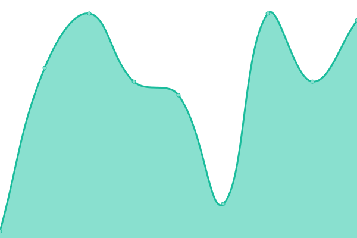

# [📈 Live Status](https://demo.upptime.js.org): <!--live status--> **🟩 All systems operational**

This repository contains the open-source uptime monitor and status page for [CASPERg267](https://gfstatus.me/team), powered by [Upptime](https://github.com/upptime/upptime).

With [Upptime](https://upptime.js.org), you can get your own unlimited and free uptime monitor and status page, powered entirely by a GitHub repository. We use [Issues](https://github.com/CASPERg267/Uptime-page/issues) as incident reports, [Actions](https://github.com/CASPERg267/Uptime-page/actions) as uptime monitors, and [Pages](https://demo.upptime.js.org) for the status page.

<!--start: status pages-->
<!-- This summary is generated by Upptime (https://github.com/upptime/upptime) -->
<!-- Do not edit this manually, your changes will be overwritten -->
<!-- prettier-ignore -->
| URL | Status | History | Response Time | Uptime |
| --- | ------ | ------- | ------------- | ------ |
|  [GF Status Bot](https://gfstatus.xyz) | 🟩 Up | [gf-status-bot.yml](https://github.com/CASPERg267/Uptime-page/commits/HEAD/history/gf-status-bot.yml) | 

 962ms
     
 | 

<a href="https://demo.upptime.js.org/history/gf-status-bot">99.92%</a>
    

|  [GF Status Dashboard](https://gfstatus.xyz) | 🟩 Up | [gf-status-dashboard.yml](https://github.com/CASPERg267/Uptime-page/commits/HEAD/history/gf-status-dashboard.yml) | 

 313ms
     
 | 

<a href="https://demo.upptime.js.org/history/gf-status-dashboard">99.92%</a>
    

|  [RadCord Bot](https://radcord.xyz) | 🟩 Up | [rad-cord-bot.yml](https://github.com/CASPERg267/Uptime-page/commits/HEAD/history/rad-cord-bot.yml) | 

 342ms
     
 | 

<a href="https://demo.upptime.js.org/history/rad-cord-bot">59.18%</a>
    

|  [Test Broken Site](https://radcord.xyz) | 🟩 Up | [test-broken-site.yml](https://github.com/CASPERg267/Uptime-page/commits/HEAD/history/test-broken-site.yml) | 

 86ms
     
 | 

<a href="https://demo.upptime.js.org/history/test-broken-site">59.59%</a>
    

<!--end: status pages-->

[**Visit our status website →**](https://demo.upptime.js.org)

## 📄 License

- Powered by: [Upptime](https://github.com/upptime/upptime)
- Code: [MIT](./LICENSE) © [CASPERg267](https://gfstatus.me/team)
- Data in the `./history` directory: [Open Database License](https://opendatacommons.org/licenses/odbl/1-0/)
